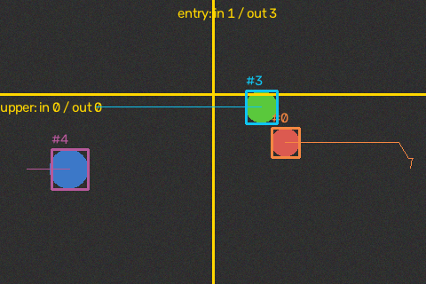
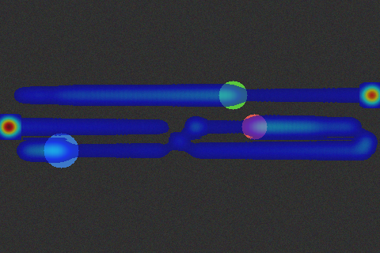
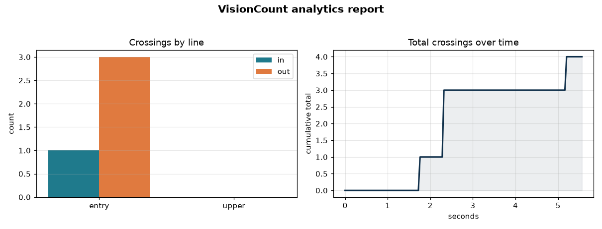

# VisionCount

**Real-time object counting & line-crossing analytics** — an OpenCV pipeline that
detects, tracks and counts objects as they cross virtual lines in a video or
webcam feed, with a Flask dashboard showing live counts and motion heatmaps.

<p align="center">
  
  
</p>

The **default** pipeline uses classic OpenCV background subtraction + a pure-NumPy
centroid tracker, so it runs with **no model weights and no heavy dependencies** —
light enough for a **Raspberry Pi**. An **optional YOLO** (ultralytics) detector is
available for harder scenes and is imported lazily so a missing `torch` never
breaks `import visioncount`.

---

## Why

Counting things that move past a point — people through a doorway, cars on a road,
parcels on a conveyor, animals at a gate — is a genuinely useful, everyday computer
vision task. Most off-the-shelf answers either need a GPU and a multi-hundred-MB
model, or are locked behind a paid cloud API. VisionCount is the opposite:

- **Zero cost, zero cloud.** Everything runs locally on free, open-source libraries.
- **Runs on a Pi.** The default path is CPU-only and dependency-light.
- **Actually works out of the box.** A built-in synthetic video means you can run
  the whole pipeline and the dashboard with a single command, no camera required.
- **Extensible.** Swap in YOLO when you need accuracy, keep the same tracking,
  counting and dashboard code.

## Features

- **Background-subtraction detector** (MOG2) with morphological mask cleanup — no
  model download, no `torch`.
- **Centroid tracker** — stable integer IDs across frames via greedy
  nearest-neighbour matching, with per-object trajectories. Pure NumPy.
- **Directional line counting** — define any number of virtual line segments;
  crossings are split into `in` / `out` using the sign of a 2D cross product, so
  direction is unambiguous regardless of line orientation. Each object is counted
  once per line (no double counting).
- **Motion heatmap** — accumulates where objects travel, with optional
  exponential decay to emphasise recent activity, rendered as a JET colormap
  overlay.
- **Flask dashboard** — live MJPEG video, a counts table, a crossings-over-time
  chart, a live heatmap, and JSON APIs (`/api/counts`, `/api/health`).
- **Matplotlib analytics report** — render a PNG summary (per-line in/out bars +
  cumulative crossings over time) from a run, headless-safe via the `Agg` backend.
- **CLI** — run on the synthetic clip, a webcam index, or a video file; optionally
  write an annotated MP4 and/or a PNG report.
- **Optional YOLO path** — `pip install visioncount[yolo]` enables an ultralytics
  detector with the exact same tracking/counting/dashboard on top. Guarded so the
  package imports fine without it.
- **Tested** — a pytest suite runs the OpenCV pipeline end-to-end on a synthetic
  clip and verifies the Flask app.

## How it works

```
frame ─▶ Detector ─▶ [Detection…] ─▶ CentroidTracker ─▶ {id: Track} ─┬▶ LineCounter ─▶ in/out counts
             │                                                        └▶ Heatmap ─▶ activity buffer
             └─ default: MOG2 background subtraction (or optional YOLO)
```

1. **Detect** foreground blobs (or YOLO boxes) in each frame.
2. **Track** them across frames, assigning stable IDs and recording a short
   trajectory (current + previous centroid).
3. **Count** a crossing when the segment between an object's previous and current
   centroid intersects a counting line; the side it came from decides `in` vs `out`.
4. **Accumulate** each object's position into the heatmap.

## Quick start

```bash
git clone https://github.com/xj16/visioncount.git
cd visioncount

python -m venv .venv
# Windows:  .venv\Scripts\activate
# Linux/Mac: source .venv/bin/activate

pip install -r requirements.txt
```

### Run the dashboard (no camera needed)

```bash
python -m visioncount.app
# open http://127.0.0.1:5000
```

It streams the built-in **synthetic** feed by default. To use a real source:

```bash
# webcam device 0
VISIONCOUNT_SOURCE=0 python -m visioncount.app
# a video file
VISIONCOUNT_SOURCE=/path/to/video.mp4 python -m visioncount.app
```

(On Windows PowerShell: `$env:VISIONCOUNT_SOURCE=0; python -m visioncount.app`)

### Run from the command line

```bash
# Synthetic clip, headless, print counts as JSON
python -m visioncount --source synthetic --frames 200 --no-window --json

# Process a video file and write an annotated MP4
python -m visioncount --source input.mp4 --output annotated.mp4 --no-window

# Live webcam with a custom horizontal counting line named "door"
python -m visioncount --source 0 --line door:0,240,640,240

# Write a Matplotlib PNG analytics report at the end
python -m visioncount --source synthetic --frames 300 --no-window --report report.png
```

The report looks like this:

<p align="center">
  
</p>

`--line` takes `name:x1,y1,x2,y2` and can be repeated for multiple lines.

### Use it as a library

```python
from visioncount import Pipeline, CountingLine
from visioncount.synthetic import frames

W, H = 640, 480
pipe = Pipeline(W, H, lines=[CountingLine("door", (W // 2, 0), (W // 2, H))])

for frame in frames(W, H, n_frames=200):      # or your own BGR frames
    result = pipe.process(frame)
    for event in result.events:
        print(event.line, event.direction, event.track_id)

print(pipe.totals())   # {'door': {'in': .., 'out': .., 'total': .., 'net': ..}}
```

### Optional: YOLO detector

```bash
pip install "visioncount[yolo]"   # pulls in ultralytics + torch
```

```python
from visioncount import Pipeline, CountingLine
from visioncount.yolo_detector import YoloDetector, yolo_available

detector = YoloDetector(weights="yolov8n.pt", classes=[0])  # person only
pipe = Pipeline(640, 480, detector=detector,
                lines=[CountingLine("gate", (320, 0), (320, 480))])
```

If ultralytics/torch are not installed, `yolo_available()` returns `False` and the
package keeps working on the default detector.

## Raspberry Pi

The default detector is CPU-only and dependency-light, which makes it a good fit
for a Pi with a camera module:

```bash
sudo apt-get install -y python3-venv libatlas-base-dev
python3 -m venv .venv && source .venv/bin/activate
pip install -r requirements.txt
VISIONCOUNT_SOURCE=0 HOST=0.0.0.0 python -m visioncount.app
```

Then open the dashboard from another device on the LAN at `http://<pi-ip>:5000`.
For lower CPU use, reduce the capture resolution and raise `min_area`.

## Configuration

Environment variables read by the dashboard:

| Variable                | Default       | Meaning                                   |
| ----------------------- | ------------- | ----------------------------------------- |
| `VISIONCOUNT_SOURCE`    | `synthetic`   | `synthetic`, a webcam index, or file path |
| `VISIONCOUNT_AUTOSTART` | `1`           | Start the worker thread on app creation   |
| `HOST`                  | `127.0.0.1`   | Bind host                                 |
| `PORT`                  | `5000`        | Bind port                                 |

`PipelineConfig` exposes tuning knobs in code: `min_area`, `max_disappeared`,
`max_distance`, `heatmap_decay`, `heatmap_radius`, `draw_trajectories`.

## Project layout

```
visioncount/
  detector.py       MOG2 background-subtraction detector (default)
  yolo_detector.py  optional, lazily-imported ultralytics detector
  tracker.py        pure-NumPy centroid tracker
  counter.py        virtual line-crossing geometry + counts
  heatmap.py        motion/occupancy heatmap accumulation
  report.py         Matplotlib PNG analytics report
  pipeline.py       orchestration + frame annotation
  synthetic.py      built-in synthetic clip generator (for demos/tests)
  cli.py            command-line entrypoint (python -m visioncount)
  app.py            Flask dashboard (video, counts, heatmap, JSON APIs)
tests/              pytest suite (pipeline + geometry + tracker + Flask)
examples/           demo image generator
```

## Development

```bash
pip install -r requirements-dev.txt
pytest -q
```

## Tech stack

**Python**, **OpenCV** (headless), **NumPy**, **Flask**, **Matplotlib**,
optionally **Ultralytics YOLO**, deployable on **Raspberry Pi**, CI via
**GitHub Actions**.

## License

[MIT](LICENSE) © 2026 xj16
