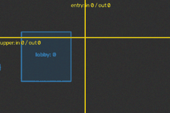

# VisionCount

**Real-time object counting & line-crossing analytics.** An OpenCV pipeline that
detects, tracks and counts objects as they cross virtual lines — and now records
every crossing, reports zone occupancy, and ships a live in-browser demo.

<p align="center">
  <a href="https://github.com/xj16/visioncount/actions/workflows/ci.yml"></a>
  
  
  <a href="LICENSE"></a>
</p>

<p align="center">
  
</p>

> The default pipeline uses classic OpenCV background subtraction + a pure-NumPy
> centroid tracker, so it runs with **no model weights and no heavy dependencies** —
> light enough for a **Raspberry Pi**. An **optional YOLO** detector drops into the
> same tracking/counting code for harder scenes.

**▶ Live in-browser demo:** the whole core pipeline is ported to dependency-free
JavaScript in [`web/`](web/) and runs entirely client-side on a `<canvas>` — no
server, no install. Open `web/index.html`, or serve it (`python -m http.server -d web`)
and drag on the video to draw your own counting lines.

---

## Why

Counting things that move past a point — people through a doorway, cars on a road,
parcels on a conveyor, animals at a gate — is a genuinely useful, everyday computer
vision task. Most off-the-shelf answers need a GPU and a multi-hundred-MB model, or
sit behind a paid cloud API. VisionCount is the opposite:

- **Zero cost, zero cloud.** Everything runs locally on free, open-source libraries.
- **Runs on a Pi.** The default path is CPU-only and dependency-light.
- **Works out of the box.** A built-in synthetic video runs the whole pipeline and
  dashboard with a single command — no camera required.
- **Real analytics, not just a number.** Every crossing is timestamped, logged,
  exportable as CSV, and optionally pushed to a webhook.
- **Extensible.** Swap in YOLO for accuracy; keep the same tracking, counting,
  zones, heatmap and dashboard.

## Features

- **Background-subtraction detector** (MOG2) with morphological mask cleanup — no
  model download, no `torch`.
- **Centroid tracker with velocity prediction** — stable integer IDs across frames
  via greedy nearest-neighbour matching against each track's *predicted* next
  position, so IDs survive brief occlusions and crossing paths. Pure NumPy.
- **Directional line counting** — any number of virtual line segments; crossings
  split into `in` / `out` from the sign of a 2D cross product, so direction is
  unambiguous regardless of orientation. Each object counted once per line.
- **Zone / ROI occupancy** — polygon regions that report live occupancy, peak,
  entries and dwell time (point-in-polygon). Line crossing answers *"how many
  passed"*; zones answer *"how many are inside right now"*.
- **Crossing analytics** — every crossing is stored (timestamp, line, direction,
  `track_id`, position) in a ring buffer and, optionally, **SQLite**; exported via
  `GET /export.csv`, queried via `GET /api/events`, and pushed to a **webhook**.
- **Motion heatmap** — decaying accumulation of where objects travel, rendered as a
  JET colormap overlay.
- **Interactive Flask dashboard** — live MJPEG video with an overlay you can
  **draw counting lines and zones on**, a counts table, a zones table, an inline
  SVG crossings chart, a recent-crossings feed, a CSV export button, and a health
  banner. JSON APIs: `/api/counts`, `/api/events`, `/api/lines`, `/api/zones`,
  `/api/health`.
- **Hardened worker** — background-thread errors surface on `/api/health` as
  `degraded`; a stale feed reports `stale`; `/video_feed` returns `503` instead of
  hanging when the source never came up.
- **Security** — per-client rate limiting, optional API key on mutating endpoints,
  locked-down CORS, request-body cap, validated & frame-clamped geometry input.
- **Matplotlib report** — a two-panel PNG (per-line in/out bars + cumulative
  crossings over time), headless-safe via the `Agg` backend.
- **CLI** — run on the synthetic clip, a webcam index, or a video file; write an
  annotated MP4, a PNG report, and/or a SQLite event log.
- **Docker** — a slim, non-root image + compose (with a `demo` profile) run the
  dashboard under **waitress** in one command.
- **Optional YOLO path** — `pip install "visioncount[yolo]"` enables an ultralytics
  detector behind the same interface, imported lazily so the package imports fine
  without it.
- **Tested** — a pytest suite runs each layer plus a flagship worker-thread
  integration test, gated at 80% coverage in CI (Linux 3.11–3.13 + Windows).

## How it works

```
frame ─▶ Detector ─▶ [Detection…] ─▶ CentroidTracker ─▶ {id: Track} ─┬▶ LineCounter ─▶ CrossEvent ─▶ EventStore (ring + SQLite + webhook)
             │                          (velocity-predicted)          ├▶ ZoneCounter ─▶ occupancy / dwell
             └─ default: MOG2 (or optional YOLO)                       └▶ Heatmap ─▶ activity buffer
```

1. **Detect** foreground blobs (or YOLO boxes) in each frame.
2. **Track** them across frames with stable IDs and short trajectories, matching
   against predicted positions.
3. **Count** a crossing when the segment between an object's previous and current
   centroid intersects a line; the cross-product sign decides `in` vs `out`.
4. **Measure** zone occupancy (point-in-polygon) and **accumulate** the heatmap.
5. **Record** each crossing for export, streaming, and charts.

See [ARCHITECTURE.md](ARCHITECTURE.md) for the full design and concurrency model.

## Quick start

```bash
git clone https://github.com/xj16/visioncount.git
cd visioncount
python -m venv .venv
# Windows:  .venv\Scripts\activate   |   Linux/Mac: source .venv/bin/activate
pip install -r requirements.txt
```

### Run the dashboard (no camera needed)

```bash
python -m visioncount.app
# open http://127.0.0.1:5000  — drag on the video to draw a counting line
```

It streams the built-in **synthetic** feed by default. Point it at a real source:

```bash
VISIONCOUNT_SOURCE=0 python -m visioncount.app                  # webcam device 0
VISIONCOUNT_SOURCE=/path/to/video.mp4 python -m visioncount.app # a video file
```

(PowerShell: `$env:VISIONCOUNT_SOURCE=0; python -m visioncount.app`)

### One-command Docker

```bash
docker compose up                    # dashboard on http://127.0.0.1:5000
docker compose --profile demo up     # same, with SQLite crossing-logging on
```

### Command line

```bash
# Synthetic clip, headless, print counts as JSON
python -m visioncount --source synthetic --frames 200 --no-window --json

# Process a video, write an annotated MP4 + a PNG report
python -m visioncount --source input.mp4 --output annotated.mp4 --report report.png --no-window

# Webcam with a named horizontal line, an occupancy zone, and a SQLite event log
python -m visioncount --source 0 \
  --line "door:0,240,640,240" \
  --zone "lobby:80,60;240,60;240,180;80,180" \
  --db run.sqlite
```

`--line` takes `name:x1,y1,x2,y2`; `--zone` takes `name:x1,y1;x2,y2;x3,y3…`
(≥ 3 semicolon-separated points). Both are repeatable. Quote the `--zone` value so
your shell doesn't split on the semicolons.

### Use it as a library

```python
from visioncount import Pipeline, CountingLine, Zone
from visioncount.synthetic import frames

W, H = 640, 480
pipe = Pipeline(
    W, H,
    lines=[CountingLine("door", (W // 2, 0), (W // 2, H))],
    zones=[Zone("lobby", [(100, 100), (400, 100), (400, 380), (100, 380)])],
)

for frame in frames(W, H, n_frames=200):        # or your own BGR frames
    result = pipe.process(frame)
    for event in result.events:
        print(event.line, event.direction, event.track_id)

print(pipe.totals())   # {'door': {'in': .., 'out': .., 'total': .., 'net': ..}}
print(pipe.zones())    # {'lobby': {'occupancy': .., 'peak': .., 'entries': ..}}
```

The report looks like this:

<p align="center">
  
</p>

## Analytics API

| Endpoint          | Method | Purpose                                              |
| ----------------- | ------ | ---------------------------------------------------- |
| `/api/counts`     | GET    | Line totals, zone occupancy, rolling series, fps     |
| `/api/events`     | GET    | Recent crossings as JSON (`?limit=N`)                |
| `/export.csv`     | GET    | Stream **all** recorded crossings as CSV             |
| `/api/lines`      | GET/POST/DELETE | List / add / remove counting lines live     |
| `/api/zones`      | GET/POST | List / add polygon occupancy zones live            |
| `/api/health`     | GET    | `ok` / `starting` / `stale` / `degraded` + error     |
| `/video_feed`     | GET    | MJPEG stream of annotated frames                     |
| `/heatmap.png`    | GET    | Current motion heatmap                               |

## Optional: YOLO detector

```bash
pip install "visioncount[yolo]"   # pulls in ultralytics + torch
```

```python
from visioncount import Pipeline, CountingLine
from visioncount.yolo_detector import YoloDetector, yolo_available

detector = YoloDetector(weights="yolov8n.pt", classes=[0])  # person only
pipe = Pipeline(640, 480, detector=detector,
                lines=[CountingLine("gate", (320, 0), (320, 480))])
```

If ultralytics/torch are not installed, `yolo_available()` returns `False` and the
package keeps working on the default detector.

## Raspberry Pi

The default detector is CPU-only and dependency-light — a good fit for a Pi with a
camera module:

```bash
sudo apt-get install -y python3-venv libatlas-base-dev
python3 -m venv .venv && source .venv/bin/activate
pip install -r requirements.txt waitress
VISIONCOUNT_SOURCE=0 HOST=0.0.0.0 VISIONCOUNT_AUTOSTART=1 \
  waitress-serve --host=0.0.0.0 --port=5000 visioncount.app:app
```

Then open the dashboard from another device on the LAN at `http://<pi-ip>:5000`.
For lower CPU use, reduce capture resolution and raise `min_area`. The Docker image
builds for arm64, and a systemd unit is a one-liner around the `waitress-serve`
command above.

## Configuration

All optional; see [`.env.example`](.env.example) for the full list.

| Variable                | Default     | Meaning                                     |
| ----------------------- | ----------- | ------------------------------------------- |
| `VISIONCOUNT_SOURCE`    | `synthetic` | `synthetic`, a webcam index, or file path   |
| `VISIONCOUNT_AUTOSTART` | `0`         | Start the worker on app creation (`1`)      |
| `VISIONCOUNT_DB`        | —           | SQLite path for durable crossing logging    |
| `VISIONCOUNT_WEBHOOK`   | —           | POST each crossing here (best-effort)       |
| `VISIONCOUNT_API_KEY`   | —           | Require this key on mutating endpoints      |
| `VISIONCOUNT_RATE_LIMIT`| `120`       | Requests/min per client (mutating + export) |
| `VISIONCOUNT_CORS_ORIGIN`| —          | Allowed CORS origin (off by default)        |
| `HOST` / `PORT`         | `127.0.0.1` / `5000` | Bind host / port                   |

`PipelineConfig` exposes code-level knobs: `min_area`, `max_disappeared`,
`max_distance`, `heatmap_decay`, `heatmap_radius`, `draw_trajectories`.

## Project layout

```
visioncount/
  detector.py       MOG2 background-subtraction detector (default)
  yolo_detector.py  optional, lazily-imported ultralytics detector
  tracker.py        pure-NumPy centroid tracker + velocity prediction
  counter.py        virtual line-crossing geometry + counts
  zone.py           polygon ROI occupancy + dwell
  events.py         crossing store: ring + SQLite + CSV + webhook
  heatmap.py        motion/occupancy heatmap accumulation
  report.py         Matplotlib PNG analytics report
  pipeline.py       orchestration + frame annotation
  synthetic.py      built-in synthetic clip generator
  cli.py            command-line entrypoint (python -m visioncount)
  app.py            Flask dashboard + analytics API (worker thread)
  templates.py      dashboard HTML
web/                dependency-free browser port of the core pipeline (live demo)
tests/              pytest suite incl. flagship worker integration test
examples/           demo image/GIF + coverage-badge generators
```

## Development

```bash
pip install -r requirements-dev.txt
pytest -q                                   # run the suite
pytest -q --cov=visioncount                 # with coverage
ruff check visioncount tests                # lint
python examples/generate_demo.py --gif      # regenerate docs/demo.gif
```

## Tech stack

**Python**, **OpenCV** (headless), **NumPy**, **Flask**, **waitress**,
**Matplotlib**, **SQLite**, optionally **Ultralytics YOLO**; a dependency-free
**JavaScript/Canvas** port for the browser demo; **Docker**; CI via
**GitHub Actions**. Deployable on a **Raspberry Pi**.

## License

[MIT](LICENSE) © 2026 xj16
